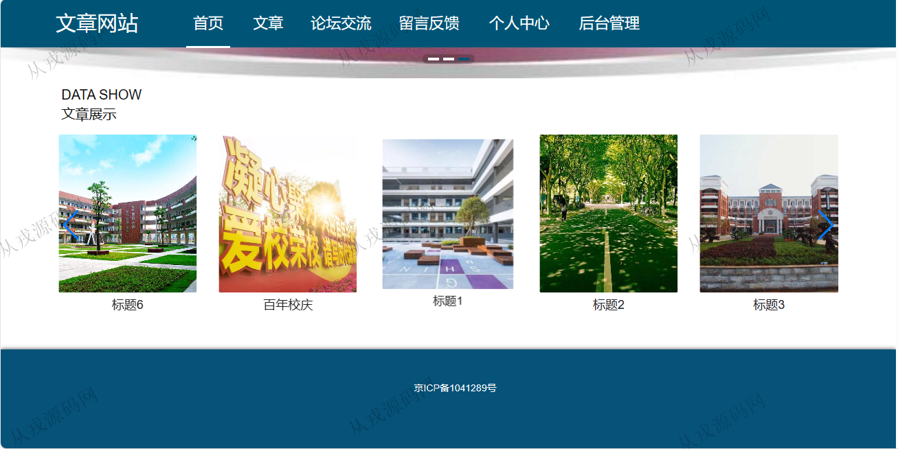
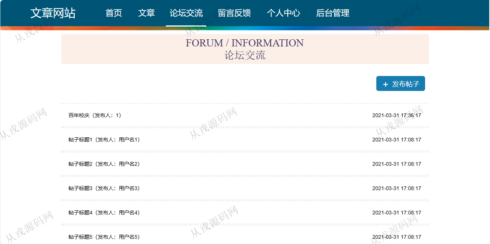
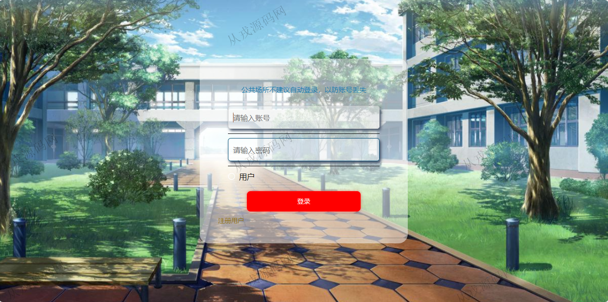
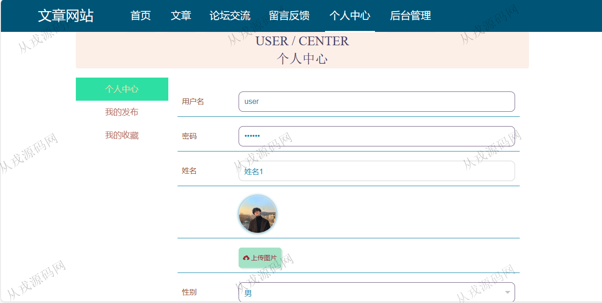
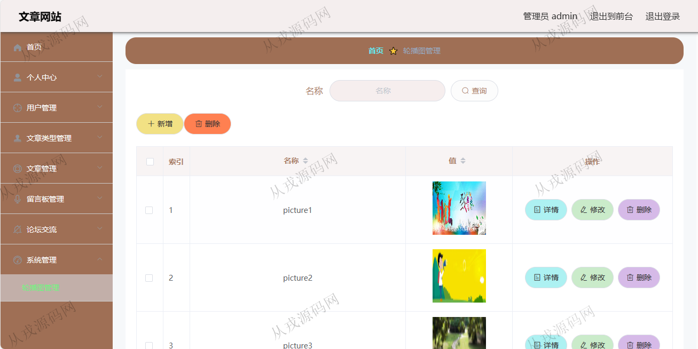
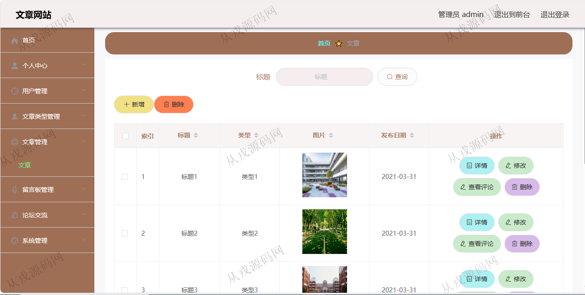
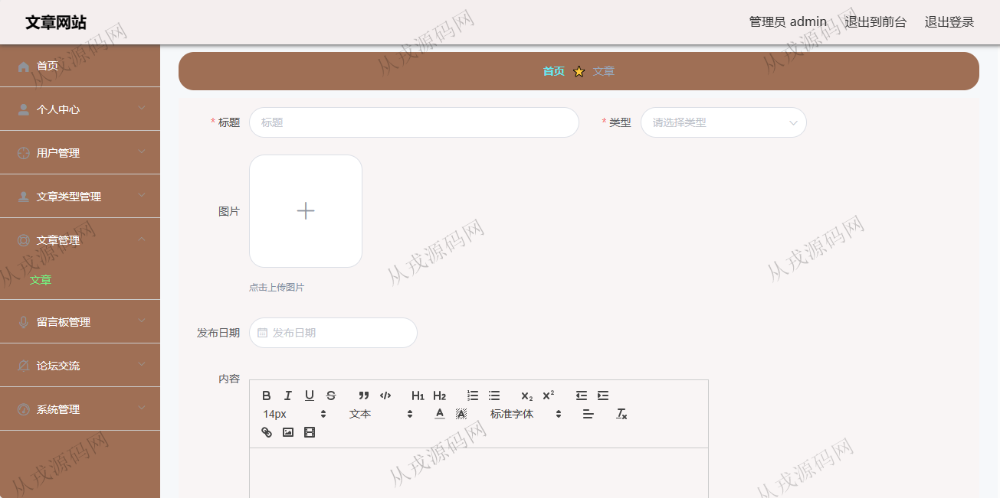

<h1 align="center">144.文章论坛管理系统</h1>

- <b>完整代码获取地址：从戎源码网 ([https://armycodes.com/](https://armycodes.com/))</b>
- <b>技术探讨、资料分享，请加QQ群：692619798</b> 
- <b>作者微信：19941326836  QQ：952045282</b> 
- <b>承接计算机毕业设计、Java毕业设计、Python毕业设计、深度学习、机器学习</b>
- <b>选题+开题报告+任务书+程序定制+安装调试+论文+答辩ppt 一条龙服务</b>
- <b>所有选题地址 ([https://github.com/YuLin-Coder/AllProjectCatalog](https://github.com/YuLin-Coder/AllProjectCatalog)) </b>

## 项目介绍
基于springboot+vue的文章论坛管理系统：前端 vue、elementui，后端 maven、springmvc、spring、mybatis；角色分为管理员、用户；集成文章展示、论坛交流、留言反馈等功能于一体的系统。

## 功能介绍

### 用户

- 基本功能：登录、注册，退出
- 网站首页：主导航栏，轮播图，文章推荐展示
- 文章：文章列表展示，文章详情，收藏，评论
- 论坛交流：帖子列表，帖子详情，发布新帖
- 留言反馈：提交留言信息
- 个人中心：个人信息查看与修改，头像上传，我的发布信息查看，我的收藏列表

### 管理员

- 用户管理：用户信息由前台用户自行注册而来，管理员查看用户信息，修改删除，管理员也可以在后台给用户新增信息
- 文章类型管理：文章类型信息的增删改查
- 文章管理：文章信息的增删改查，文章图片上传，文章内容支持富文本编辑
- 留言板管理：管理员查看用户的留言信息，管理员可以修改和删除，并对用户的留言信息进行回复
- 论坛交流：管理员可以在后台对用户发布的帖子进行修改和删除，同时管理员也可以发布帖子
- 轮播图管理：轮播图信息的增删改查，对应网站首页的轮播图展示

## 环境

- <b>IntelliJ IDEA 2021.3</b>

- <b>Mysql 5.7.26</b>

- <b>Node 14.14.0</b>

- <b>JDK 1.8</b>

## 运行截图

